**Подготовительный этап.**

Установка Ubuntu 18.04 LTS в виртуальной машине в ОС *Windows*

**Установка Virtual Box**

Скачать VM VirtualBox можно с [официального сайта разработчика](https://www.virtualbox.org/wiki/Downloads)

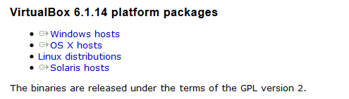

Выберите **VirtualBox 6.1.14 platform** для *Windows hosts* и скачайте файл установки. 

*Версия может отличаться.*

После того, как скачается файл, запустите его.

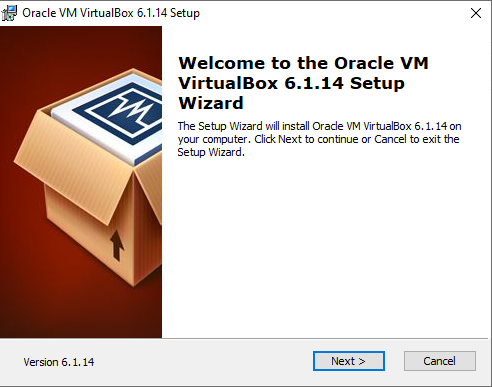

После запуска установщика VM VirtualBox нажимаем **Next.**

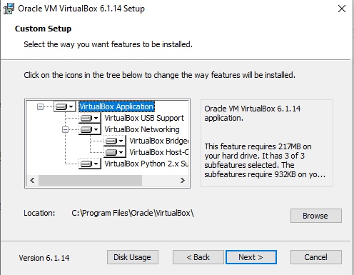

Выбираем расположение папки установки и нажимаем **Next.**

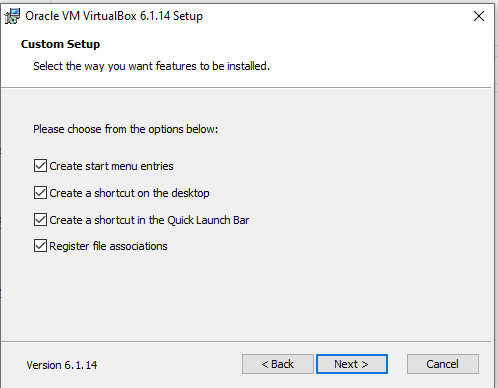

Можно выбрать:
  1. Создать ярлык на рабочем столе.
  2. Создать ярлык в меню быстрого запуска.
  3. Ассоциировать файлы с VirtualBox.

Рекомендуется оставить галочки по умолчанию.

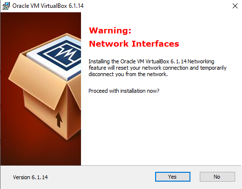
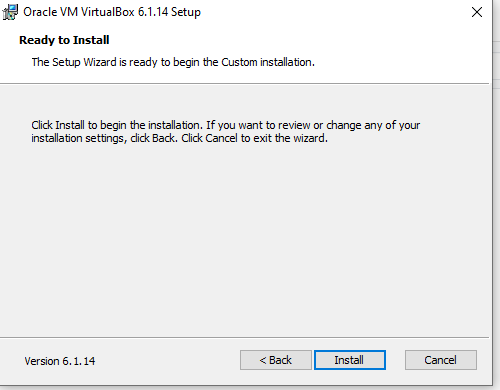

Далее нас предупреждают о том, что в процессе установки будет перезагружено соединение с сетью. Чтобы продолжить установку, необходимо нажать **Yes.** 
Нажимаем **Install.**
Далее необходимо согласиться со всеми запросами на установку драйверов в операционную систему Windows.
Процесс установки VM VirtualBox.

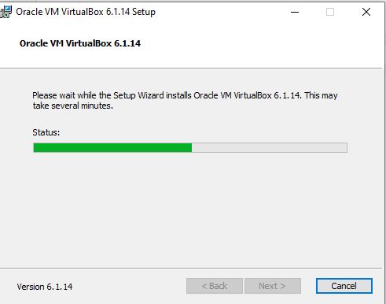
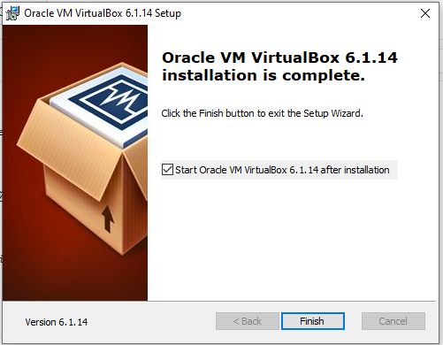

На этом этапе установка VM VirtualBox завершена. Чтобы выйти из программы установки необходимо нажать Finish.

**Установка ОС Linux/MacOS**

Linux: воспользуйтесь [официальной документацией](https://www.virtualbox.org/manual/ch02.html#install-linux-host)

MacOS: воспользуйтесь [официальной документацией](https://www.virtualbox.org/manual/ch02.html#installation-mac)

**Загрузить ISO образ Linux**

Скачать с официального сайта. Рекомендуется устанавливать [Ubuntu 18.04 LTS Desktop](https://ubuntu.com/download/alternative-downloads). В самом низу страницы в разделе *BitTorrent* найдете ссылку на торрент файл.

**Первоначальная настройка VM VirtualBox**

Запустите VirtualBox. Далее, создадим новую виртуальную машину. Для этого нажмите кнопку **Создать**

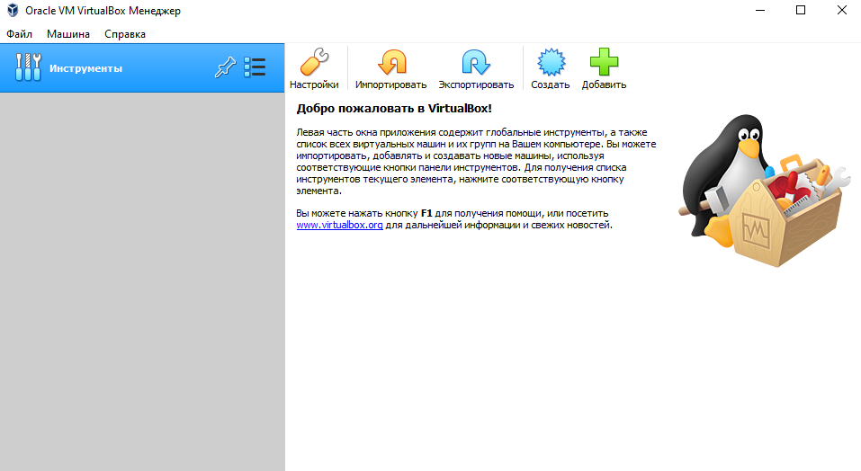

Определите имя, тип и разрядность виртуальной машины

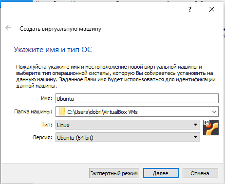

Укажите выделяемое количество оперативной памяти

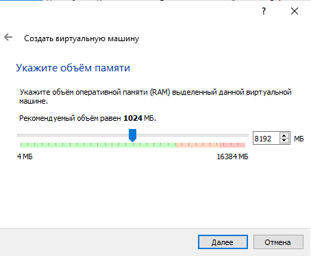

Далее, создайте новый виртуальный жесткий диск, на который в дальнейшем будем устанавливать ОС.

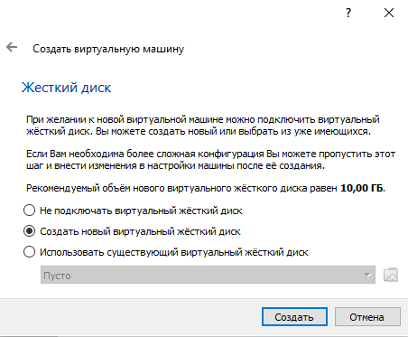

Выберем типа виртуального жесткого диска (рекомендуется оставить значение по умолчанию **VDI**)

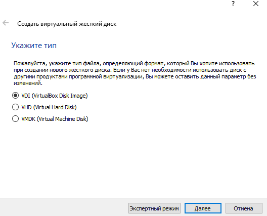

Укажем, что наш диск является динамическим. (В отличии от фиксированного, файл виртуального диска будет заполняться по мере накопления в нем данных.)

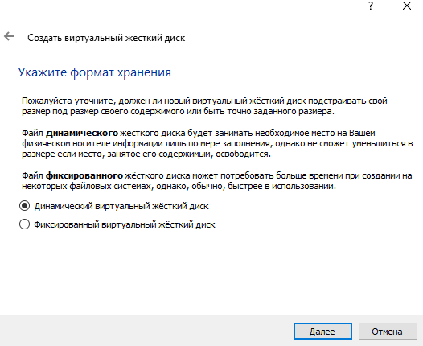

Укажем количество выделяемой памяти жесткого диска

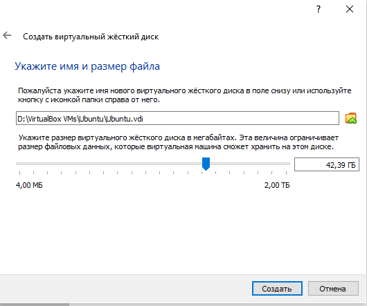

В завершающем этапе необходимо выбрать ISO образ операционной системы Linux, который был загружен ранее. Нажмите продолжить.

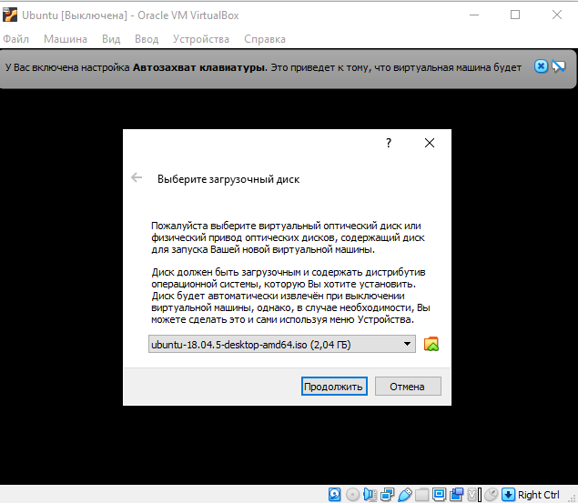

**Установка Ubuntu 18.04 LTS**
Далее процесс установки на VM ничем не отличается от обычной установки. На первом этапе выбираем язык установки, и желаемую опцию . Например, можно выбрать меню *Try Ubuntu*. Тогда, представиться возможность ознакомиться с OS Ubuntu не устанавливая её. В нашем случае выбираем опцию *Install Ubuntu*. 

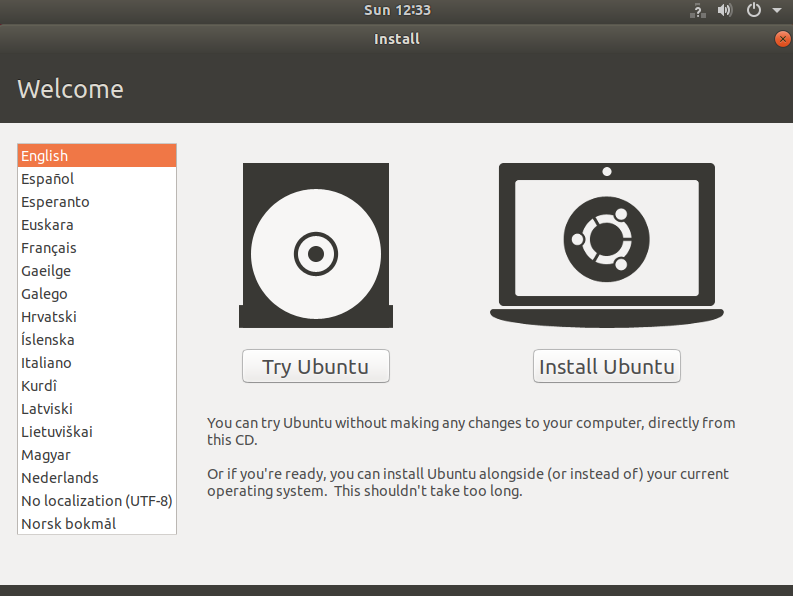

В начале установки требуется выбрать язык. Выбираем ENGLISH. После чего выбираем раскладку клавиатуры. Тут можно сразу выбрать русскую, а можно добавить после установки.

*Примечание. Выбор русского языка интерфейса приведет к наименованию многих директорий на русском языке. Что приведет к трудностям при навигации в консоли.*
На следующем этапе предлагается выбрать тип установки. Выбираем *Normal installation*.

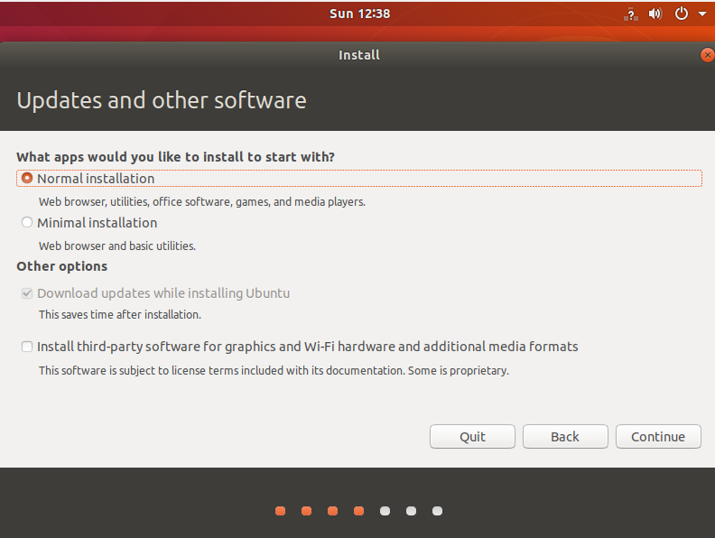

Далее программа  установки предложит очистить содержимое диска и затем выполнить установку. В представленном примере, других ОС не обнаружено, поэтому выбираем опцию **Erase disk and install Ubuntu**
*Примечение. В случае, если на компьютере уже установлена другая ОС будет предложено выполнить установку "рядом".*

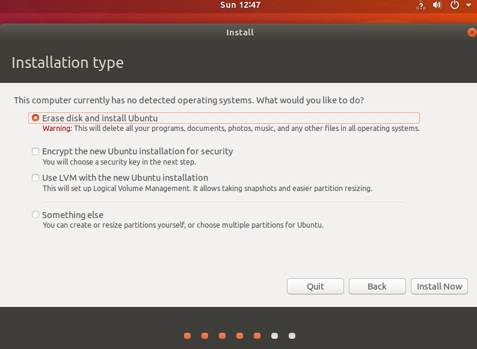

Далее выберите имя пользователя, имя компьютера и пароль. Нажимаем **Next**, запускается процесс установки. Самое время сделать себе чашечку кофе, взять плитку шоколада и расслабиться :)

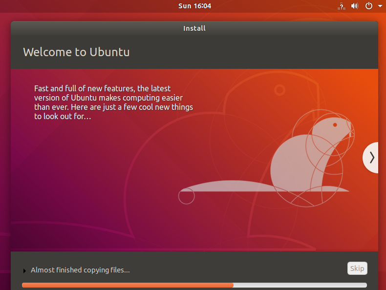

После установки перезагрузите систему и выполните вход, используя имя пользователя и пароль, которые вы определили во время установки.
