# Программы и задания ИТМО
## Программная инженерия 

| Семестр | Предмет | Языки программирования, инструменты и программы |
| --- | --- | --- |
| 1 | [Основы профессиональной деятельности](https://github.com/CandyGoose/ITMO_Software_engineering/tree/main/1_term_Software_engineering/OPD) |  |
| 1 | [Информатика](https://github.com/CandyGoose/Informatic_SE) |     |
| 1 | [Программирование](https://github.com/CandyGoose/Programming_1_term_SE) |  |
| 1 | [История (Реформы и реформаторы в истории России)](https://github.com/CandyGoose/ITMO_ICT/tree/main/1_term_ICT/History) |  |
| 1 | [Иностранный язык (английский)](https://github.com/CandyGoose/ITMO_ICT/tree/main/1_term_ICT/English) |  |
|  |  |  |
| 2 | [Основы профессиональной деятельности](https://github.com/CandyGoose/OPD_web) |               |
| 2 | [Программирование](https://github.com/CandyGoose/Programming_2_term_SE) |     <a href="https://openjfx.io/" target="_blank" rel="noreferrer"> 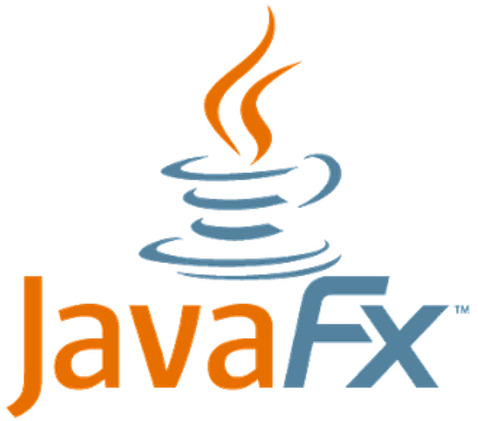 </a>  |
| 2 | [Базы данных](https://github.com/CandyGoose/Database_SE) |    |
| 2 | [Математика (базовый уровень)](https://github.com/CandyGoose/ITMO_Software_engineering/tree/main/2_term_Software_engineering/Mathematics) |  |
| 2 | [Дискретная математика (базовый уровень)](https://github.com/CandyGoose/ITMO_Software_engineering/tree/main/2_term_Software_engineering/Discrete_math) |  |
| 2 | [Коммуникации и командообразование](https://github.com/CandyGoose/ITMO_Software_engineering/tree/main/2_term_Software_engineering/Communication_and_team_building) |  |
| 2 | [Безопасность жизнедеятельности](https://github.com/CandyGoose/ITMO_Software_engineering/tree/main/2_term_Software_engineering/Life_safety) |  |
| 2 | [Иностранный язык (английский)](https://github.com/CandyGoose/ITMO_Software_engineering/tree/main/2_term_Software_engineering/English) |  |
|  |  |  |
| 3 | [Веб-программирование](https://github.com/CandyGoose/Web_programming_SE) |            <a href="https://www.oracle.com/java/technologies/java-ee-glance.html" target="_blank" rel="noreferrer"> 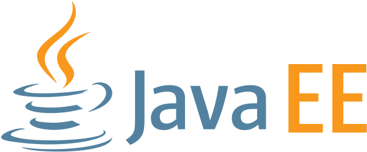 </a>    <a href="https://javaee.github.io/javaserverfaces-spec/" target="_blank" rel="noreferrer"> 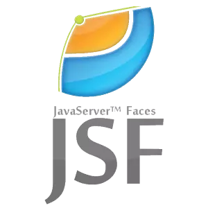 </a>   <a href="https://eclipse.dev/eclipselink/" target="_blank" rel="noreferrer"> 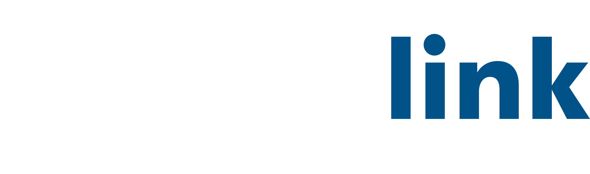 </a>    |
| 3 | [Языки программирования](https://github.com/CandyGoose/Programming_languages) |  |
| 3 | [Математика (базовый уровень)](https://github.com/CandyGoose/ITMO_Software_engineering/tree/main/3_term_Software_engineering/Mathematics) |  |
| 3 | [Физика](https://github.com/CandyGoose/ITMO_Software_engineering/tree/main/3_term_Software_engineering/Physics) |  |
| 3 | [Теория вероятностей](https://github.com/CandyGoose/ITMO_Software_engineering/tree/main/3_term_Software_engineering/Probability_theory) |  |
| 3 | [Бизнес-модели основных секторов инновационной экономики](https://github.com/CandyGoose/ITMO_Software_engineering/tree/main/3_term_Software_engineering/Business_models) |  |
| 3 | [Иностранный язык (английский)](https://github.com/CandyGoose/ITMO_Software_engineering/tree/main/3_term_Software_engineering/English) |  |
|  |  |  |
| 4 | [Архитектура компьютера](https://github.com/CandyGoose/Computer_architecture) |    |
| 4 | [Основы программной инженерии](https://github.com/CandyGoose/Fundamentals_of_SE) | <a href="https://www.uml.org/" target="_blank" rel="noreferrer"> 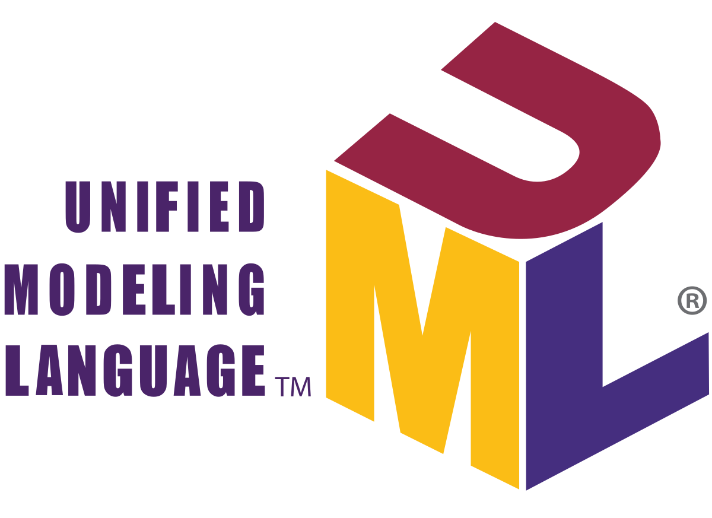 </a>     <a href="https://ant.apache.org/" target="_blank" rel="noreferrer"> 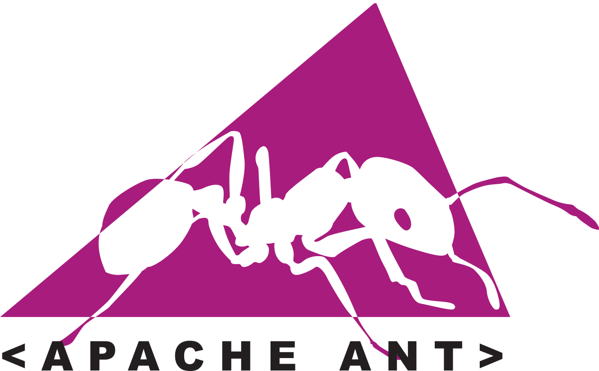 </a>  |
| 4 | [Математическая статистика](https://github.com/CandyGoose/Mathematical_statistics) |  |
| 4 | [Физика](https://github.com/CandyGoose/ITMO_Software_engineering/tree/main/4_term_Software_engineering/Physics) |       |
| 4 | [Вычислительная математика](https://github.com/CandyGoose/Computational_math) |  |
| 4 | [Методы оптимизации](https://github.com/CandyGoose/Optimization_methods) |  |
| 4 | [Инновационная экономика и технологическое предпринимательство](https://github.com/CandyGoose/ITMO_Software_engineering/tree/main/4_term_Software_engineering/Innovative_economy) |  |
| 4 | [Техники публичных выступлений и презентаций](https://github.com/CandyGoose/ITMO_Software_engineering/tree/main/4_term_Software_engineering/Techniques_of_public_speaking) |  |
| 4 | [Иностранный язык (английский)](https://github.com/CandyGoose/ITMO_Software_engineering/tree/main/4_term_Software_engineering/English) |  |
|  |  |  |
| 5 | [Операционные системы](https://github.com/CandyGoose/Operating_systems) |    |
| 5 | [Системы искусственного интеллекта](https://github.com/CandyGoose/Artificial_intelligence_systems) |  <a href="https://protege.stanford.edu/" target="_blank" rel="noreferrer"> 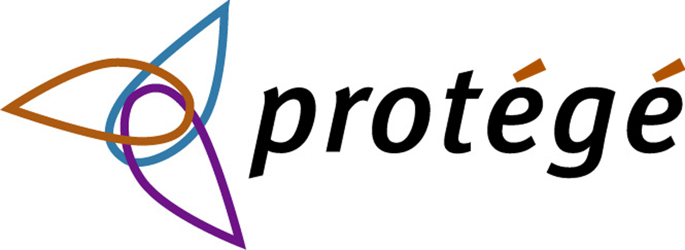 </a>     |
| 5 | [Разработка веб-приложений](https://github.com/CandyGoose/Web_application_development) |                   <a href="https://eslint.org/" target="_blank" rel="noreferrer"> 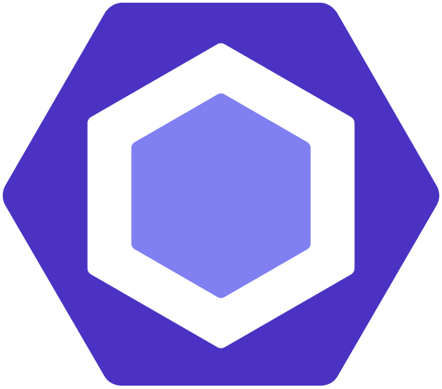 </a>  <a href="https://nodejs.org/en" target="_blank" rel="noreferrer"> 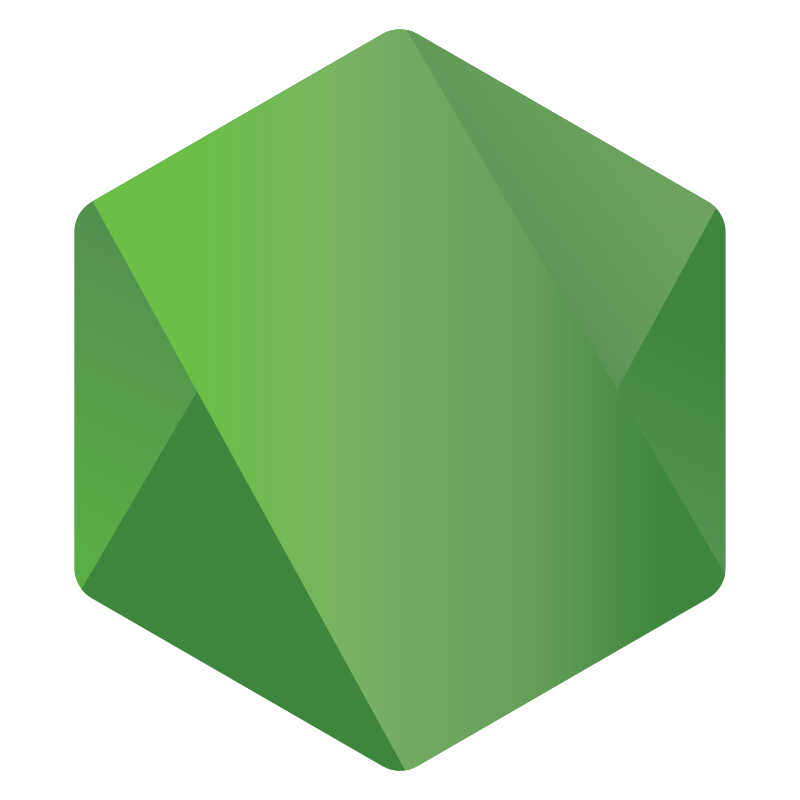 </a>        |
| 5 | [Биометрия и нейротехнологии](https://github.com/CandyGoose/Biometrics_and_neurotechnology) |     |
| 5 | [Мультимедиа технологии](https://github.com/CandyGoose/ITMO_Software_engineering/tree/main/5_term_Software_engineering/Multimedia_technologies) |       |
| 5 | [Полигональное моделирование](https://github.com/CandyGoose/Polygonal_modeling) |  |
| 5 | [Визуальная культура и визуальное восприятие](https://github.com/CandyGoose/ITMO_Software_engineering/tree/main/5_term_Software_engineering/Visual_culture_and_visual_perception) |  |
| 5 | [Иностранный язык (китайский)](https://github.com/CandyGoose/ITMO_Software_engineering/tree/main/5_term_Software_engineering/Chinese_language) |  |
| 5 | [Основы сетевых технологий](https://github.com/CandyGoose/ITMO_Software_engineering/tree/main/5_term_Software_engineering/Fundamentals_of_network_technologies) |  |
| 5 | [Обработка сигналов](https://github.com/CandyGoose/ITMO_Software_engineering/tree/main/5_term_Software_engineering/Signal_processing) |  |
|  |  |  |
| 6 | [Разработка мультимедийных приложений](https://github.com/CandyGoose/Multimedia_application_development) |     |
| 6 | [Разработка мобильных приложений](https://github.com/CandyGoose/Mobile_application_development) |      |
| 6 | [Теория систем](https://github.com/CandyGoose/Theory_of_systems) |    |
| 6 | [Нейротехнологии и аффективные вычисления](https://github.com/CandyGoose/Neurotechnology_and_afficient_computing) |     |
| 6 | [Компьютерные сети](https://github.com/CandyGoose/Computer_networks) |  |
| 6 | [Введение в работу с игровыми движками](https://github.com/CandyGoose/Introduction_to_working_with_game_engines) |  <a href="https://learn.microsoft.com/ru-ru/dotnet/csharp/" target="_blank" rel="noreferrer"> 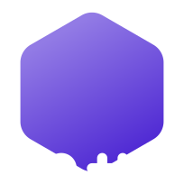 </a> |
| 6 | [Иностранный язык (китайский)](https://github.com/CandyGoose/ITMO_Software_engineering/tree/main/6_term_Software_engineering/Chinese_language) |  |
| 6 | [Основы проектирования информационных систем](https://github.com/CandyGoose/ITMO_Software_engineering/tree/main/6_term_Software_engineering/Fundamentals_of_information_system_design) |   |
| 6 | [Философия](https://github.com/CandyGoose/ITMO_Software_engineering/tree/main/6_term_Software_engineering/Philosophy) |  |
|  |  |  |
| 7 | [Моделирование](https://github.com/CandyGoose/Modeling) |      |
| 7 | [Экономика программной инженерии](https://github.com/CandyGoose/Economics_of_Software_Engineering) |   |
| 7 | [Интеллектуальная обработка экспериментальных данных](https://github.com/CandyGoose/Intelligent_processing_of_experimental_data) |   |
| 7 | [Работа с нейроинтерфейсами](https://github.com/CandyGoose/Working_with_neural_interfaces) |    <a href="https://www.arduino.cc/" target="_blank" rel="noreferrer"> 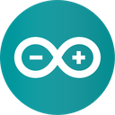 </a> |
| 7 | [Визуализация данных](https://github.com/CandyGoose/Data_visualization) |     |
| 7 | [Разработка приложений виртуальной реальности](https://github.com/CandyGoose/Virtual_reality_application_development) |   |
| 7 | [Нейротехнологии на основе электроэнцефалографии](https://github.com/CandyGoose/Neurotechnologies_based_on_electroencephalography) |    |
| 7 | [Когнитивная психология](https://github.com/CandyGoose/ITMO_Software_engineering/tree/main/7_term_Software_engineering/Cognitive_psychology) |  |
| 7 | [Информационная безопасность](https://github.com/CandyGoose/ITMO_Software_engineering/tree/main/7_term_Software_engineering/Information_security) |  |
| 7 | [Реинжиниринг программных систем](https://github.com/CandyGoose/ITMO_Software_engineering/tree/main/7_term_Software_engineering/Software_systems_reengineering) |  <a href="https://ramussoftware.com/" target="_blank" rel="noreferrer"> 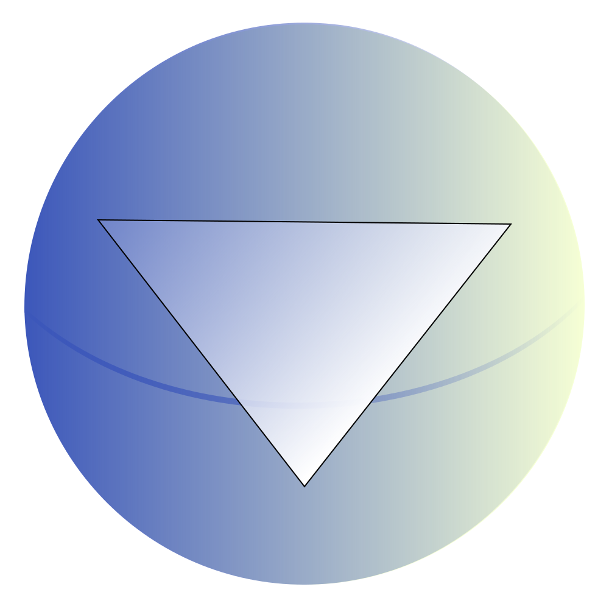 </a> <a href="https://www.lucidchart.com/pages/er-diagrams" target="_blank" rel="noreferrer"> 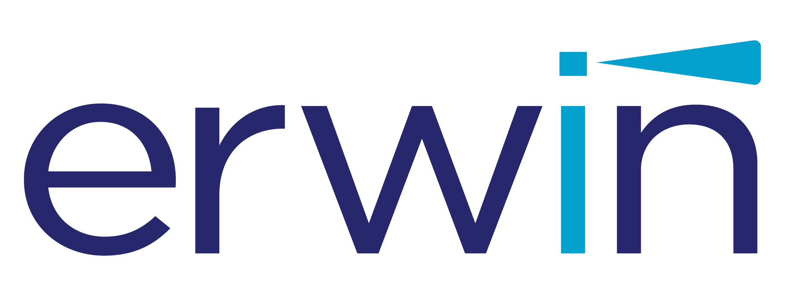 </a>  |
|  |  |  |
| 8 | [Защита и действия человека в условиях ЧС](https://github.com/CandyGoose/ITMO_Software_engineering/tree/main/8_term_Software_engineering/Human_protection_and_actions_in_emergency_situations) |  |
| 8 | [Учебная, ознакомительная](https://github.com/CandyGoose/ITMO_Software_engineering/tree/main/8_term_Software_engineering/Educational_introductory_practice) |     |
| 8 | [Производственная, технологическая (проектно-технологическая)](https://github.com/CandyGoose/ITMO_Software_engineering/tree/main/8_term_Software_engineering/Production_technological_design_and_technological_practice) |      |
| 8 | [Производственная, преддипломная](https://github.com/CandyGoose/ITMO_Software_engineering/tree/main/8_term_Software_engineering/Industrial_pre-graduate_practice) |  |
| 8 | [Подготовка к защите и защита ВКР](https://github.com/CandyGoose/ITMO_Software_engineering/tree/main/8_term_Software_engineering/Final_qualifying_work) |               |
|  |  |  |
| 2 | [Инженерный дизайн - CAD (факультатив)](https://github.com/CandyGoose/CAD_elective) |  |
| 2 | [Эмоциональный интеллект (факультатив)](https://github.com/CandyGoose/ITMO_Software_engineering/tree/main/2_term_Software_engineering/EQ) |  |
| 3 | [Введение в GameDev: Unreal Engine 4 и Blueprints (факультатив)](https://github.com/CandyGoose/UE4_and_Blueprints_elective) |   |
| 3 | [Анализ естественного языка методами искусственного интеллекта (факультатив)](https://github.com/CandyGoose/NLP_elective) |     |
| 4 | [Когнитивные ошибки в понимании людей (факультатив)](https://github.com/CandyGoose/ITMO_Software_engineering/tree/main/4_term_Software_engineering/Cognitive_errors) |  |
| 4 | [Контакт с собой и другими (факультатив)](https://github.com/CandyGoose/ITMO_Software_engineering/tree/main/4_term_Software_engineering/Contact_with_yourself_and_others) |  |
| 4 | [Эмоциональная устойчивость (факультатив)](https://github.com/CandyGoose/ITMO_Software_engineering/tree/main/4_term_Software_engineering/Emotional_stability) |  |
| 4 | [Креативное материаловедение (факультатив)](https://github.com/CandyGoose/ITMO_Software_engineering/tree/main/4_term_Software_engineering/Materials_science) |  |
| 5 | [Физика в GameDev (факультатив)](https://github.com/CandyGoose/Physics_in_GameDev) |     |
| 5 | [Введение в GameDev: основы игрового ИИ (факультатив)](https://github.com/CandyGoose/The_Basics_of_Gaming_AI_elective) |   |
| 5 | [Grammar of Emotions (факультатив)](https://github.com/CandyGoose/ITMO_Software_engineering/tree/main/5_term_Software_engineering/Grammar_of_Emotions) |  |
| 5 | [Навыки обучения и работы с информацией (факультатив)](https://github.com/CandyGoose/ITMO_Software_engineering/tree/main/5_term_Software_engineering/Learning_and_information_management_skills) |  |
| 5 | [Инструменты и ресурсы для учебной и научной работы (факультатив)](https://github.com/CandyGoose/ITMO_Software_engineering/tree/main/5_term_Software_engineering/Tools_and_resources_for_academic_and_scientific_work) |  |
| 6 | [Испанский язык (факультатив)](https://github.com/CandyGoose/ITMO_Software_engineering/tree/main/6_term_Software_engineering/Spanish_language) |  |
| 6 | [Основы поиска по истории семьи (факультатив)](https://github.com/CandyGoose/ITMO_Software_engineering/tree/main/6_term_Software_engineering/Basics_of_family_history_search) |  |
| 6 | [Анализ социальных медиа на языке Python (факультатив)](https://github.com/CandyGoose/Social_media_analysis_in_Python) |   |
| 6 | [Data Art: как это сделано? Веб-технологии и инструменты для художников и исследователей (факультатив)](https://github.com/CandyGoose/Data_Art_how_is_it_made) |    |
| 7 | [Коммерциализация и трансфер биомедицинских технологий (факультатив)](https://github.com/CandyGoose/ITMO_Software_engineering/tree/main/7_term_Software_engineering/Commercialization_and_transfer_of_biomedical_technologies) |  |
| 7 | [ML + OR: принятие оптимальных решений на основе машинного обучения (факультатив)](https://github.com/CandyGoose/ML-OR_making_optimal_decisions_based_on_machine_learning) |   |
| 8 | [Основы практического инвестирования (факультатив)](https://github.com/CandyGoose/ITMO_Software_engineering/tree/main/8_term_Software_engineering/Fundamentals_of_practical_investment) |  |
| 8 | [Основы DevOps методологии (факультатив)](https://github.com/CandyGoose/Fundamentals_of_DevOps_methodology) |         |
